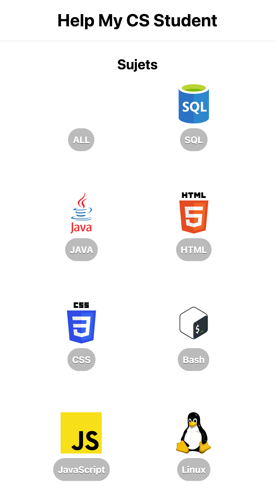
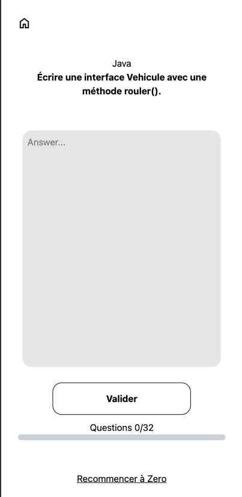
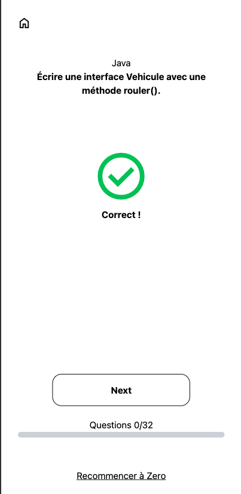

# HelpMyCsStudent

<section >
  
  
  
</section>

## C'est quoi ?

J’ai développé une plateforme permettant aux étudiants du BUT Informatique de réaliser de courtes révisions dans différentes matières.

Le projet a été principalement conçu pour une utilisation mobile.J’ai développé une plateforme permettant aux étudiants du BUT Informatique de réaliser de courtes révisions dans différentes matières. Le projet a été principalement conçu pour une utilisation mobile.

## Où ? 

Vous pouvez vous rendre sur [Help My CS Student](https://helpmycsstudent.netlify.app).

##
